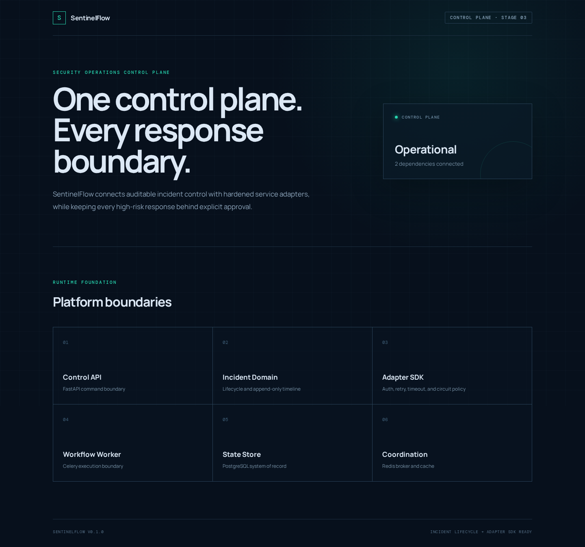

# SentinelFlow

[](https://github.com/MintKangaroo/SentinelFlow/actions/workflows/ci.yml)
[](https://www.python.org/)
[](https://fastapi.tiangolo.com/)
[](https://react.dev/)
[](LICENSE)

SentinelFlow는 탐지, 분석, 승인, 대응, 검증, 보고를 하나의 감사 가능한 흐름으로 연결하는
**AI-Native Security Operations Control Plane**입니다.

각 보안 제품의 내부 기능을 다시 만들지 않습니다. AI-SOC Dashboard, ThreatGraph, RedMind,
Patchtower, AutoPentest AI, AIShield를 Adapter로 연결하고, SentinelFlow는 Incident 상태,
사람의 승인, 실행 순서, 실패 복구, 검증 결과와 감사 기록을 통제합니다.

> 현재 `develop` 기준 구현 단계는 3단계입니다. 플랫폼 기반, Incident Lifecycle,
> Append-only Timeline, 보안 기본값이 적용된 Integration Adapter SDK를 제공합니다.
> Playbook 실행과 실제 외부 서비스 연동은 이후 단계에서 순차적으로 추가됩니다.

## 실행 화면



위 이미지는 로컬 Docker Compose 환경에서 실행한 실제 웹 화면입니다. 12단계 운영
대시보드가 완성되면 Incident Queue, SLA, MTTD, MTTR, Approval Queue, Workflow Timeline을
보여주는 운영 화면 캡처를 추가합니다.

## SentinelFlow가 해결하는 문제

보안 운영 과정은 여러 도구에 나뉘어 있고, 분석 결과가 실제 변경으로 이어지는 순간에는
명확한 통제가 필요합니다. SentinelFlow는 다음 원칙으로 이 간극을 연결합니다.

- 탐지 도구의 Alert를 추적 가능한 Incident로 승격합니다.
- IOC와 관계 정보, AI 분석, 제안된 대응을 Evidence로 보존합니다.
- AI 제안과 실제 위험 작업 사이에 Human Approval을 강제합니다.
- 변경 전 dry-run, 실행 후 검증, 실패 시 rollback/compensation을 하나의 Workflow로 묶습니다.
- 모든 상태 전이와 의사결정, 외부 호출 결과를 Workspace 범위의 감사 기록으로 남깁니다.
- 외부 제품은 교체 가능한 Adapter 뒤에 두고 Control Plane이 특정 Vendor 구현에 종속되지
  않도록 합니다.

SentinelFlow가 최종적으로 연결하는 흐름은 다음과 같습니다.

```text
Alert 수신
  → Incident 생성
  → ThreatGraph 상관분석
  → RedMind AI 분석
  → Playbook 제안
  → Human Approval
  → Patchtower 대응 실행
  → AutoPentest / AIShield 검증
  → Incident 종료
  → 사후 보고서
```

## 연동 대상

| 서비스 | SentinelFlow에서의 역할 | 연동 단계 |
| --- | --- | --- |
| AI-SOC Dashboard | Alert 수신 및 탐지 원본 연결 | 7단계 |
| ThreatGraph | IOC, 자산, 공격 관계 상관분석 | 7단계 |
| RedMind | Incident 분석, 대응 계획과 Evidence 제안 | 8단계 |
| Patchtower | 서버 점검, dry-run, 패치, 복구와 rollback | 9단계 |
| AutoPentest AI | 허가된 범위의 공격 경로 재검증 | 10단계 |
| AIShield | AI 서비스 및 모델의 강건성 평가 | 11단계 |

## 현재 구현

### 플랫폼 기반

- FastAPI 비동기 Control API와 환경별 OpenAPI 노출 정책
- PostgreSQL, 비동기 SQLAlchemy, Alembic 마이그레이션
- Redis를 Broker로 사용하는 JSON 전용 Celery Worker
- React와 TypeScript 웹 클라이언트, 보안 헤더가 적용된 nginx
- OpenTelemetry API Trace와 로컬 Collector
- 재현 가능한 Docker Compose 개발 환경
- Ruff, mypy strict, pytest coverage, Vitest, TypeScript, Compose를 검사하는 GitHub Actions

### Incident 및 Timeline

- `new`부터 `closed`, `reopened`까지 명시적인 Incident 상태 머신
- 허용되지 않은 상태 전이 거부
- Workspace 단위 생성, 조회, 목록과 데이터베이스 관계 격리
- 낙관적 버전을 사용한 동시 변경 충돌 방지
- 쓰기 요청별 Idempotency Key
- 행위자, 사유, 상태와 순번을 보존하는 Append-only Timeline
- ORM 이벤트와 PostgreSQL Trigger를 함께 사용하는 수정·삭제 방지

### Integration Adapter SDK

- Bearer Token, API Key, Basic Auth, No Auth 공통 전략
- 원문 Credential 대신 UUID 기반 `CredentialReference`
- `workspace_id`를 반드시 포함하는 `SecretManager` Port
- 연결, 읽기, 쓰기, Pool 및 전체 논리 연산 Timeout
- 지수 Backoff와 `Retry-After`를 지원하는 제한된 Retry
- 비멱등 요청은 Idempotency Key가 있을 때만 Retry
- Closed, Open, Half-open 상태의 비동기 Circuit Breaker
- Redirect 미추적, 고정 HTTPS Origin, 절대 URL 및 Header Injection 거부
- Credential, 응답 본문, 내부 Transport 상세를 제외한 오류 메시지
- 서비스명과 HTTP 결과만 기록하는 저민감도 OpenTelemetry Span

## 아키텍처

```text
┌──────────────────┐
│ React Operations │
│ Dashboard        │
└────────┬─────────┘
         │ HTTPS / REST
┌────────▼───────────────────────────────────────────────────┐
│ FastAPI Control API                                       │
│  ├─ Incident Application Service                          │
│  ├─ Explicit Domain State Machine                         │
│  └─ Integration Adapter SDK                               │
│      ├─ Workspace-scoped SecretManager                    │
│      ├─ Auth / Timeout / Retry / Circuit Breaker           │
│      └─ Vendor REST Adapter                               │
└──────┬──────────────────┬───────────────────────┬──────────┘
       │                  │                       │ OTLP
┌──────▼──────┐    ┌──────▼──────┐       ┌───────▼────────┐
│ PostgreSQL  │    │ Redis/Celery │       │ OTel Collector │
│ System of   │    │ Coordination │       │ Traces         │
│ Record      │    │ & Workers    │       └────────────────┘
└─────────────┘    └──────────────┘
                            │
             ┌──────────────▼──────────────────────────────┐
             │ AI-SOC · ThreatGraph · RedMind · Patchtower │
             │ AutoPentest AI · AIShield                   │
             └─────────────────────────────────────────────┘
```

Domain 정책은 FastAPI, SQLAlchemy, Celery, Vendor SDK와 분리합니다. PostgreSQL만 내구성 있는
System of Record이며 Redis는 Lock, Broker와 일시적 조정 상태에만 사용합니다.

자세한 설계는 [아키텍처 문서](docs/architecture.md)와
[Integration Adapter SDK 문서](docs/integration-adapter-sdk.md)를 참고하십시오.

## 보안 통제

| 통제 | 현재 상태 | 구현 위치 또는 예정 단계 |
| --- | --- | --- |
| Integration Credential 원문 DB 저장 금지 | 구현 | `CredentialReference`, `SecretManager` |
| Workspace 격리 | Incident/Adapter 구현 | Repository 조건, Workspace-scoped secret lookup |
| Idempotency Key | Incident/Adapter 구현 | API write, 비멱등 Retry 제한 |
| 요청 서명 검증 | 예정 | 7단계 Webhook ingest |
| Webhook Replay 방지 | 예정 | 7단계 nonce/timestamp 저장 |
| 위험 작업 Human Approval | 예정 | 6단계 |
| 위험도 상승 시 재승인 | 예정 | 6단계 및 Workflow 통합 |
| 변경 전 dry-run | 예정 | 9단계 Patchtower |
| Rollback 및 Compensation | 예정 | 5단계 Workflow, 9단계 Response |
| 전체 Audit Log | Timeline 구현, 전역 Audit 예정 | 2단계 및 후속 단계 |
| AI 단독 위험 작업 실행 금지 | 설계 강제 예정 | 6단계 이후 |

현재 API의 `X-Workspace-ID`와 `X-Actor-ID`는 격리 문맥이며 인증 수단이 아닙니다. 운영 환경은
신뢰할 수 있는 Identity Gateway가 사용자 입력 헤더를 제거하고 인증된 Workspace와 Actor를
주입해야 합니다. SentinelFlow를 공개 네트워크에 직접 노출하지 마십시오.

자세한 내용은 [보안 정책](SECURITY.md)과 [위협 모델](docs/threat-model.md)을 확인하십시오.

## 빠른 시작

### 요구사항

- Docker Engine 및 Docker Compose Plugin
- 로컬 개발 시 Python 3.12 이상
- 로컬 웹 개발 시 Node.js 20 이상

### 전체 스택 실행

```bash
cp .env.example .env
docker compose up --build
```

서비스가 준비되면 다음 주소를 사용할 수 있습니다.

| 서비스 | 기본 주소 |
| --- | --- |
| 웹 화면 | <http://localhost:3000> |
| API 정보 | <http://localhost:8000/> |
| Swagger UI | <http://localhost:8000/docs> |
| Readiness | <http://localhost:8000/api/v1/health/ready> |

`.env.example` 값은 로컬 개발 전용입니다. 공유 또는 운영 환경에서는 데이터베이스 비밀번호,
네트워크 접근 정책, TLS, Identity Gateway, Secret Manager를 별도로 구성해야 합니다.

종료할 때 데이터 볼륨을 보존하려면 다음 명령을 사용합니다.

```bash
docker compose down
```

로컬 데이터까지 제거하는 `docker compose down --volumes`는 테스트 데이터가 필요 없을 때만
사용하십시오.

## Incident API 예시

쓰기 요청에는 Workspace, Actor, Idempotency Key가 필요합니다.

```bash
curl -X POST http://localhost:8000/api/v1/incidents \
  -H 'Content-Type: application/json' \
  -H 'X-Workspace-ID: 11111111-1111-4111-8111-111111111111' \
  -H 'X-Actor-ID: analyst@example.com' \
  -H 'Idempotency-Key: incident-demo-001' \
  -d '{
    "title": "의심스러운 관리자 로그인",
    "description": "업무 시간 외 신규 위치에서 관리자 로그인이 탐지됨",
    "severity": "high"
  }'
```

상태 전이에는 현재 Aggregate Version을 전달합니다.

```bash
curl -X POST http://localhost:8000/api/v1/incidents/INCIDENT_ID/transitions \
  -H 'Content-Type: application/json' \
  -H 'X-Workspace-ID: 11111111-1111-4111-8111-111111111111' \
  -H 'X-Actor-ID: analyst@example.com' \
  -H 'Idempotency-Key: transition-demo-001' \
  -d '{
    "target_status": "triaging",
    "reason": "초기 분류 시작",
    "expected_version": 1
  }'
```

전체 Endpoint와 오류 계약은 [API 문서](docs/api.md)에 정리되어 있습니다.

## Adapter SDK 사용 원칙

외부 서비스별 Adapter는 Vendor 요청·응답 변환만 담당하고 공통 보안 정책을 우회하지 않습니다.
Credential 원문을 생성자나 데이터베이스 모델에 전달하지 않고 `CredentialReference`만
사용합니다.

```python
from uuid import UUID

from sentinelflow.integrations import (
    AdapterConfig,
    AdapterRequestContext,
    BearerTokenAuthentication,
    CredentialReference,
    IntegrationHTTPClient,
)

client = IntegrationHTTPClient(
    AdapterConfig(
        service_name="threatgraph",
        base_url="https://threatgraph.internal",
    ),
    secret_manager=workspace_secret_manager,
    authentication=BearerTokenAuthentication(
        CredentialReference(
            UUID("22222222-2222-4222-8222-222222222222")
        )
    ),
)

response = await client.request(
    "GET",
    "/v1/indicators",
    context=AdapterRequestContext(
        workspace_id=UUID("11111111-1111-4111-8111-111111111111")
    ),
    params={"value": "example.test"},
)
```

`workspace_secret_manager`는 Vault, AWS Secrets Manager, GCP Secret Manager 같은 승인된
외부 저장소를 연결하는 구현체여야 합니다. SentinelFlow 데이터베이스에 원문 Secret을
보관하는 구현은 허용되지 않습니다.

## 로컬 개발

```bash
python3.12 -m venv .venv
.venv/bin/python -m pip install -e ".[dev]"
npm --prefix web ci
make check
```

개별 프로세스는 다음 명령으로 실행합니다.

```bash
make api
make worker
make web
```

전체 품질 게이트는 다음 항목을 포함합니다.

```bash
python -m ruff check .
python -m ruff format --check .
python -m mypy src tests
python -m pytest
npm --prefix web run typecheck
npm --prefix web test -- --run
npm --prefix web run build
docker compose config --quiet
```

## 저장소 구조

```text
sentinelflow/
├─ src/sentinelflow/
│  ├─ api/              FastAPI Router와 Transport Schema
│  ├─ application/      Use Case와 Port
│  ├─ domain/           Framework 비의존 Domain 정책
│  ├─ infrastructure/   PostgreSQL, Redis Adapter
│  └─ integrations/     외부 보안 서비스 Adapter SDK
├─ migrations/          Alembic Schema 이력
├─ tests/               Backend 단위 및 통합 테스트
├─ web/                 React + TypeScript 웹 클라이언트
├─ deploy/              nginx와 OpenTelemetry 설정
├─ docs/                아키텍처, API, 위협 모델과 단계별 문서
├─ HANDOFF.md           세션 간 구현 인수인계 체크포인트
└─ compose.yaml         로컬 Control Plane Stack
```

## 브랜치 및 커밋 전략

```text
main
└─ 항상 실행 가능한 안정 버전

develop
└─ 다음 릴리스 통합

feat/<기능명>
└─ 기능별 작업

fix/<문제명>
└─ 버그 수정

docs/<문서명>
└─ 문서 변경
```

기능은 최신 `develop`에서 분기하고, 테스트와 문서를 포함한 PR을 다시 `develop`로
병합합니다. `main`에는 릴리스 검증을 마친 `develop`만 병합합니다. 커밋은 Conventional
Commits 형식을 사용합니다. 자세한 내용은 [기여 가이드](CONTRIBUTING.md)를 참고하십시오.

## 로드맵

- [x] 플랫폼 초기화
- [x] Incident Lifecycle 및 Timeline
- [x] Integration Adapter SDK
- [ ] Versioned Playbook Model
- [ ] Auditable Workflow Engine
- [ ] Risk-based Human Approval
- [ ] AI-SOC 및 ThreatGraph 연동
- [ ] RedMind 분석 연동
- [ ] Patchtower 대응 연동
- [ ] AutoPentest 사후 검증
- [ ] AIShield 강건성 평가
- [ ] 운영 대시보드
- [ ] End-to-End Incident Response Demo

세부 완료 조건과 커밋 계획은 [단계별 로드맵](docs/roadmap.md), 현재 작업 상태는
[인수인계 문서](HANDOFF.md)에서 확인할 수 있습니다.

## 현재 제한사항

- 아직 실제 외부 보안 서비스로 요청을 보내는 Vendor Adapter는 없습니다.
- Adapter SDK는 공통 경계만 제공하며 Webhook 서명과 Replay 방지는 7단계에서 구현합니다.
- Playbook, Workflow, Approval, Action Execution, Validation, Report는 아직 실행되지 않습니다.
- `responding` 상태로의 Incident 전이는 실제 대응 권한이나 실행을 의미하지 않습니다.
- 인증된 Identity Gateway와 운영 Secret Manager 없이 공개 환경에 배포할 수 없습니다.
- AutoPentest 기능은 소유하거나 명시적으로 허가받은 대상에만 사용할 수 있습니다.

## 라이선스

[MIT License](LICENSE)
