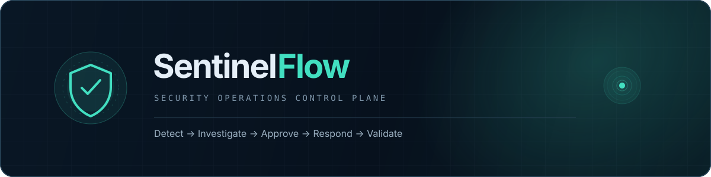
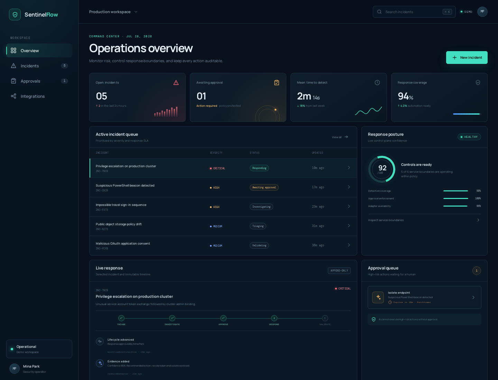
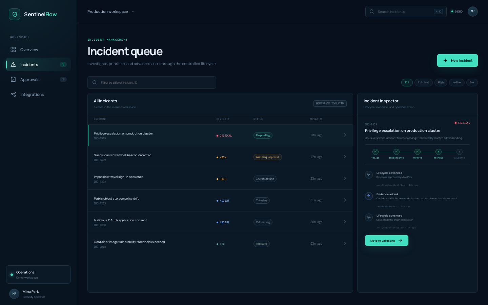
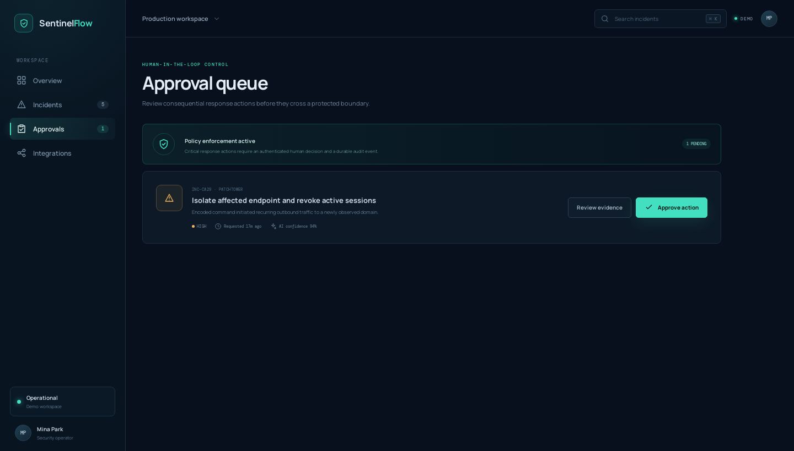
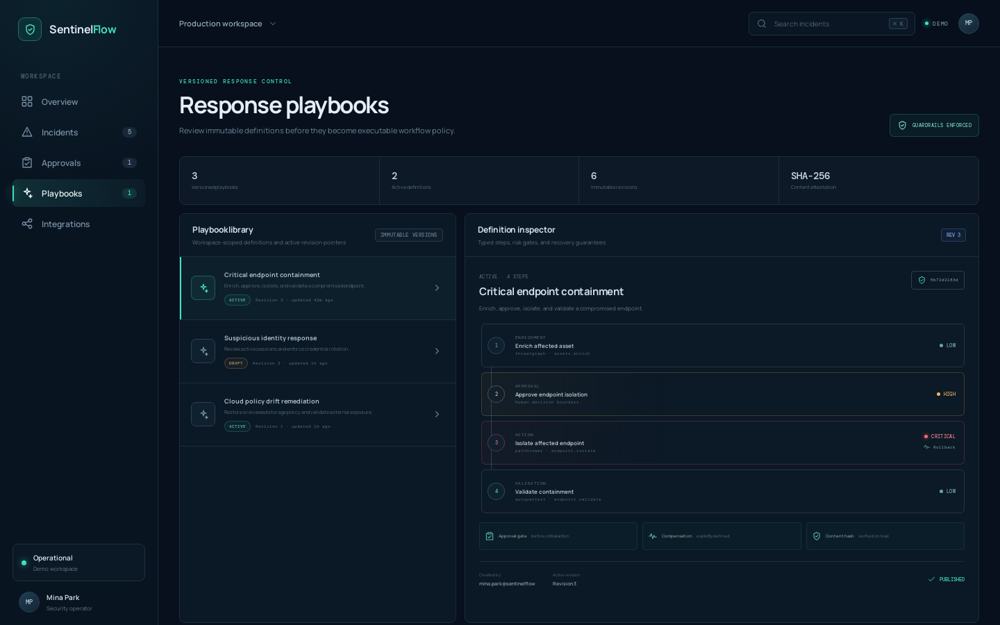
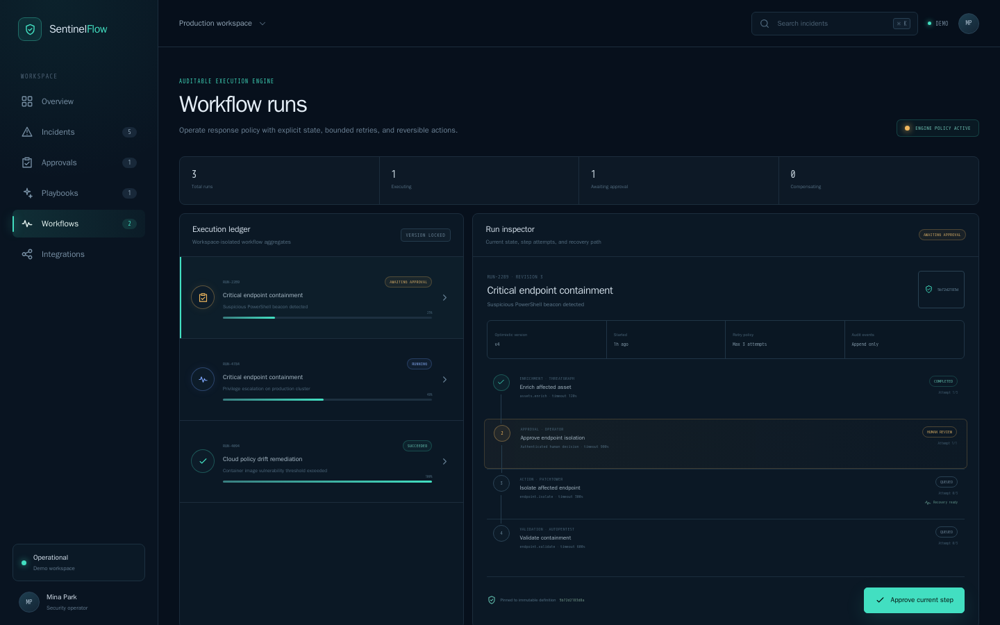
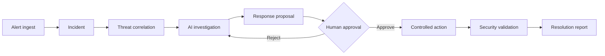
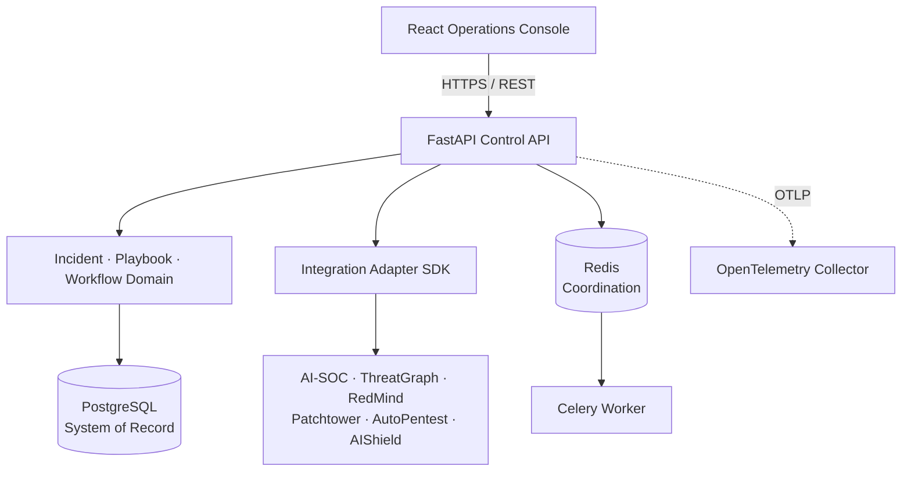

<p align="center">
  
</p>

<p align="center">
  <a href="https://github.com/MintKangaroo/SentinelFlow/actions/workflows/ci.yml"></a>
  
  
  
  
  <a href="LICENSE"></a>
</p>

<p align="center">
  <strong>탐지부터 검증까지, 모든 보안 대응 경계를 하나의 감사 가능한 흐름으로.</strong><br />
  SentinelFlow는 여러 보안 도구를 연결하고 사람의 승인을 강제하는 AI-Native SOC Control Plane입니다.
</p>

<p align="center">
  <a href="#-빠른-시작">빠른 시작</a> ·
  <a href="#-운영-대시보드">대시보드</a> ·
  <a href="#-아키텍처">아키텍처</a> ·
  <a href="docs/api.md">API</a> ·
  <a href="docs/threat-model.md">위협 모델</a> ·
  <a href="CONTRIBUTING.md">기여하기</a>
</p>

---

## 🖥️ 운영 대시보드

아래 이미지는 `?demo=1` 재현 모드에서 직접 실행해 캡처한 실제 React 화면입니다. 목업 이미지가
아니며, 동일한 UI가 라이브 모드에서는 FastAPI의 Incident, Playbook, Workflow API를 사용합니다.

<p align="center">
  
</p>

대시보드는 다음 작업을 하나의 화면에서 처리합니다.

- 실시간 Readiness와 Workspace 범위 Incident 목록 조회
- 제목·ID 검색, 심각도 필터, Incident 상세 및 Append-only Timeline 확인
- Incident 생성과 낙관적 버전을 사용한 안전한 Lifecycle 전이
- `awaiting_approval` Incident의 Human-in-the-loop 승인 흐름
- Immutable Revision, Typed Step, Risk Gate를 확인하고 최신 Playbook을 Publish
- Workflow Run의 현재 상태, Step Attempt, Approval Gate, Recovery 경로 확인과 승인
- 서비스 Adapter 상태와 공통 보안 정책 확인
- 모바일 Sidebar, Empty/Loading/Error 상태, API 장애 상태 처리
- 서버 없이 UI 전체를 검증할 수 있는 결정적 `?demo=1` 재현 모드

<table>
  <tr>
    <td width="58%">
      
      <br /><sub><b>Incident Workspace</b> — 검색, 필터, Timeline, 상태 전이</sub>
    </td>
    <td width="42%">
      
      <br /><sub><b>Approval Queue</b> — 보호된 대응 경계와 승인 UI</sub>
    </td>
  </tr>
</table>

<p align="center">
  
  <br /><sub><b>Versioned Playbooks</b> — Typed Step, Approval Gate, Rollback, SHA-256 Definition Attestation</sub>
</p>

<p align="center">
  
  <br /><sub><b>Auditable Workflows</b> — Explicit State, Bounded Retry, Human Gate, Compensation Path</sub>
</p>

> [!NOTE]
> 데모 모드의 Incident·지표·Integration 상태는 문서와 UI 검증을 위한 고정 데이터입니다.
> 일반 경로(`/`)에서는 Incident, Playbook, Workflow 조회와 지원되는 Command를 실제 API로 처리합니다.
> 독립 Approval Aggregate와 Vendor별 운영 Adapter는 로드맵에 따라 확장 중입니다.

## ✨ SentinelFlow가 하는 일

보안 운영에는 탐지 도구, 위협 그래프, AI 분석, 패치와 검증 도구가 각각 존재합니다.
SentinelFlow는 이 기능을 다시 만들지 않고, 도구 사이의 **통제와 증거**를 소유합니다.

| 운영 문제 | SentinelFlow의 통제 |
| --- | --- |
| Alert와 실제 대응이 여러 도구에 분산됨 | Alert를 추적 가능한 Incident와 Timeline으로 연결 |
| AI가 위험 작업을 바로 실행할 수 있음 | 고위험 경계에서 명시적인 Human Approval 요구 |
| 재시도 때문에 같은 작업이 중복 실행됨 | Idempotency Key와 낙관적 Aggregate Version 강제 |
| 외부 서비스 장애가 전체 대응을 전파함 | Timeout, 제한된 Retry, Circuit Breaker 제공 |
| Credential이 로그나 DB에 노출될 수 있음 | UUID Reference와 Workspace-scoped Secret Manager 사용 |
| 누가 무엇을 결정했는지 남지 않음 | 행위자·사유·순서를 Append-only Event로 보존 |

### End-to-end response flow



```text
Detect  →  Triage  →  Investigate  →  Approve  →  Respond  →  Validate  →  Close
```

## 🧱 현재 구현

### Control API & Incident domain

- Async FastAPI Application Factory와 환경별 OpenAPI 정책
- `new`부터 `closed`, `reopened`까지 명시적인 Incident 상태 머신
- Workspace별 생성·조회·목록·상태 전이·Note·Timeline API
- Aggregate Version 기반 Optimistic Concurrency Control
- 쓰기 요청별 Idempotency Key와 안정적인 오류 계약
- ORM Event와 PostgreSQL Trigger로 보호되는 Append-only Timeline

### Integration Adapter SDK

- Bearer Token, API Key, Basic Auth, No Auth 전략
- 원문 Secret 대신 UUID 기반 `CredentialReference`
- Workspace 범위를 강제하는 `SecretManager` Port
- HTTP Phase 및 전체 논리 연산 Timeout
- `Retry-After`를 존중하는 제한된 지수 Backoff
- 비멱등 요청의 Idempotency-aware Retry
- Closed / Open / Half-open 비동기 Circuit Breaker
- HTTPS 고정 Origin, Redirect·절대 URL·Header Injection 차단
- Credential·응답 본문을 제외한 저민감도 Error와 Trace

### Versioned response playbooks

- Workspace 범위 Playbook 생성·조회·목록·Revision·Publish·Archive API
- Enrichment, Approval, Action, Validation, Notification Typed Step
- 실행 가능한 표현식을 허용하지 않는 선언적 Condition DSL
- Critical/High Action보다 앞선 Human Approval Step 강제
- Critical/High Action의 명시적인 Rollback 정의 강제
- 생성 후 수정·삭제가 불가능한 Immutable Revision과 Audit Event
- Canonical JSON의 SHA-256 Definition Hash
- Idempotency Key와 낙관적 Aggregate Version을 사용한 동시성 통제

### Auditable workflow execution

- Published Playbook Revision과 Definition Hash를 Run 생성 시 고정하는 실행 Snapshot
- `pending`, `running`, `awaiting_approval`, `compensating`과 Terminal 상태의 명시적 상태 머신
- Step별 Attempt 예산, Timeout 결과, 실패 후 제한된 명시적 Retry
- Approval Step에서 실행을 멈추고 인증된 Actor의 결정을 Event로 기록
- 취소·실패 시 완료된 Action을 역순으로 보상하는 Compensation 상태
- Workspace 복합 외래키, Expected Version, Idempotency Key를 적용한 Run/Step/Event 저장소
- ORM Guard와 PostgreSQL Trigger가 보호하는 Append-only Workflow Event
- Run 생성·목록·조회·시작·결과·재시도·승인·취소·보상·시간 초과 API

현재 Workflow API는 내구성 있는 실행 상태와 감사 경계를 소유합니다. Celery가 Vendor
Adapter를 호출하고 Step 결과를 되돌려주는 비동기 Dispatcher는 다음 통합 단계입니다.

### Platform & web

- React 19 + TypeScript 기반 SOC Operations Dashboard
- PostgreSQL 17, SQLAlchemy Async, Alembic Migration
- Redis Broker와 JSON 전용 Celery Worker
- OpenTelemetry API Trace와 로컬 Collector
- 보안 Header가 적용된 nginx Runtime
- Docker Compose 기반 재현 가능한 로컬 환경
- Ruff, mypy strict, pytest coverage, Vitest, TypeScript, Production Build CI

## 🏗️ 아키텍처



Domain 정책은 FastAPI, SQLAlchemy, Celery, HTTPX와 분리되어 있습니다. PostgreSQL만 내구성
있는 System of Record이며 Redis는 Broker와 일시적인 조정 상태에만 사용합니다.

더 자세한 내용은 [아키텍처](docs/architecture.md), [API 계약](docs/api.md),
[Adapter SDK](docs/integration-adapter-sdk.md), [위협 모델](docs/threat-model.md)을 확인하세요.

## 🚀 빠른 시작

### Docker Compose

요구사항은 Docker Engine과 Docker Compose Plugin입니다.

```bash
git clone https://github.com/MintKangaroo/SentinelFlow.git
cd SentinelFlow
cp .env.example .env
docker compose up --build
```

| Service | URL | 용도 |
| --- | --- | --- |
| Operations Console | <http://localhost:3000> | 실제 API를 사용하는 대시보드 |
| Reproducible Demo | <http://localhost:3000/?demo=1> | 서버 데이터와 무관한 화면·기능 데모 |
| Control API | <http://localhost:8000> | FastAPI API |
| Swagger UI | <http://localhost:8000/docs> | 개발 환경 API Explorer |
| Readiness | <http://localhost:8000/api/v1/health/ready> | DB·Redis 상태 확인 |

로컬 데이터를 보존하며 종료하려면 다음을 실행합니다.

```bash
docker compose down
```

> [!WARNING]
> `.env.example`은 로컬 개발 전용입니다. 운영 환경에서는 TLS, Identity Gateway,
> Network Policy, 승인된 Secret Manager와 별도 Credential을 구성해야 합니다.

### Local development

```bash
python3.12 -m venv .venv
.venv/bin/python -m pip install -e ".[dev]"
npm --prefix web ci

make api   # http://localhost:8000
make web   # http://localhost:3000
```

## 🔌 API 예시

모든 Incident 요청은 Workspace 범위를 포함하며, 쓰기 요청에는 Actor와 Idempotency Key가
추가로 필요합니다.

```bash
curl -X POST http://localhost:8000/api/v1/incidents \
  -H 'Content-Type: application/json' \
  -H 'X-Workspace-ID: 11111111-1111-4111-8111-111111111111' \
  -H 'X-Actor-ID: analyst@example.com' \
  -H 'Idempotency-Key: incident-demo-001' \
  -d '{
    "title": "Suspicious administrator sign-in",
    "description": "New location and impossible travel detected",
    "severity": "high"
  }'
```

```bash
curl http://localhost:8000/api/v1/incidents \
  -H 'X-Workspace-ID: 11111111-1111-4111-8111-111111111111'
```

전체 Endpoint, Header와 오류 형식은 [API 문서](docs/api.md)에 정리되어 있습니다.

## 🔐 Security by default

| Control | 상태 | 구현 |
| --- | :---: | --- |
| Workspace data isolation | ✅ | Repository 조건과 복합 Foreign Key |
| Append-only incident audit | ✅ | ORM Guard + PostgreSQL Trigger |
| Optimistic concurrency | ✅ | Aggregate Version / Expected Version |
| Request idempotency | ✅ | Workspace-scoped Idempotency Key |
| Secret value persistence 금지 | ✅ | Credential Reference + Secret Manager Port |
| SSRF / Origin escape 방어 | ✅ | HTTPS 고정 Origin과 URL 검증 |
| Bounded retry / Circuit breaker | ✅ | 공통 Integration HTTP Client |
| Human approval UI boundary | ✅ | `awaiting_approval` Lifecycle 전이 |
| Immutable playbook revisions | ✅ | PostgreSQL Trigger + SHA-256 Definition Hash |
| High-risk action guard | ✅ | 선행 Approval과 Rollback Domain Validation |
| Auditable workflow state | ✅ | Snapshot + OCC + Append-only Event |
| Bounded retry / timeout / compensation | ✅ | Explicit Workflow State Machine |
| 독립 다중 승인 정책 | 🚧 | Approval Aggregate 단계 |
| Webhook signature / replay 방어 | 🚧 | Detection Integration 단계 |

현재 `X-Workspace-ID`와 `X-Actor-ID`는 격리 문맥이지 인증 수단이 아닙니다. 운영 환경에서는
신뢰할 수 있는 Identity Gateway가 외부 입력 Header를 제거하고 인증된 값을 주입해야 합니다.
SentinelFlow를 인증 계층 없이 공개 네트워크에 직접 노출하지 마세요.

취약점 제보 절차는 [SECURITY.md](SECURITY.md)를 따릅니다.

## 🧪 품질 게이트

```bash
make check
```

위 명령은 다음 검사를 모두 실행합니다.

```text
Ruff lint + format
Mypy strict
Pytest + coverage ≥ 90%
TypeScript typecheck
Vitest component tests
Vite production build
Docker Compose configuration
```

개별 명령:

```bash
python -m ruff check .
python -m ruff format --check .
python -m mypy src tests
python -m pytest
npm --prefix web run typecheck
npm --prefix web test -- --run
npm --prefix web run build
docker compose config --quiet
```

## 🗂️ 저장소 구조

```text
sentinelflow/
├── src/sentinelflow/
│   ├── api/              # FastAPI routes, schemas, error contract
│   ├── application/      # Use cases and ports
│   ├── domain/           # Framework-independent incident policies
│   ├── infrastructure/   # PostgreSQL, SQLAlchemy, Redis adapters
│   └── integrations/     # Secure integration adapter SDK
├── migrations/           # Versioned Alembic schema
├── tests/                # Backend unit and integration tests
├── web/                  # React SOC operations console
├── deploy/               # Runtime entrypoint and telemetry config
├── docs/                 # Architecture, API, threat model, screenshots
└── compose.yaml          # Reproducible local stack
```

## 🗺️ Roadmap

- [x] Platform bootstrap, persistence, worker, observability
- [x] Incident lifecycle and append-only timeline
- [x] Secure Integration Adapter SDK
- [x] SOC Operations Dashboard and deterministic demo
- [x] Versioned response playbooks
- [x] Auditable workflow state, retries, timeout and compensation
- [ ] Celery workflow dispatch and external action execution
- [ ] Risk-based multi-approver policy
- [ ] AI-SOC, ThreatGraph and RedMind vendor adapters
- [ ] Patchtower response orchestration
- [ ] AutoPentest and AIShield validation
- [ ] End-to-end incident report

완료 조건과 단계별 설계는 [Roadmap](docs/roadmap.md)에서 확인할 수 있습니다.

## 🤝 Contributing

기능 브랜치는 최신 `develop`에서 시작하고 테스트와 문서를 포함한 Pull Request로
통합합니다. Commit은 Conventional Commits 형식을 사용합니다.

자세한 개발 환경, PR Checklist와 Code Style은 [CONTRIBUTING.md](CONTRIBUTING.md)를
참고하세요.

## 📄 License

SentinelFlow is available under the [MIT License](LICENSE).
